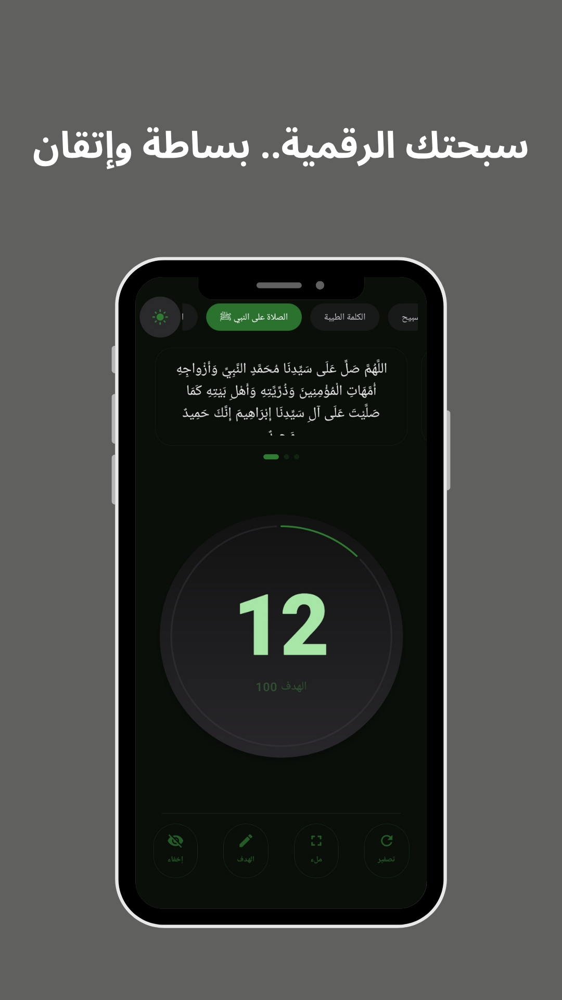
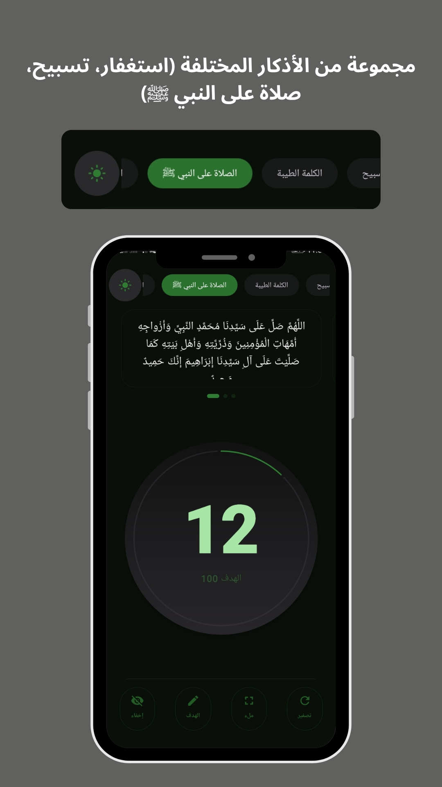
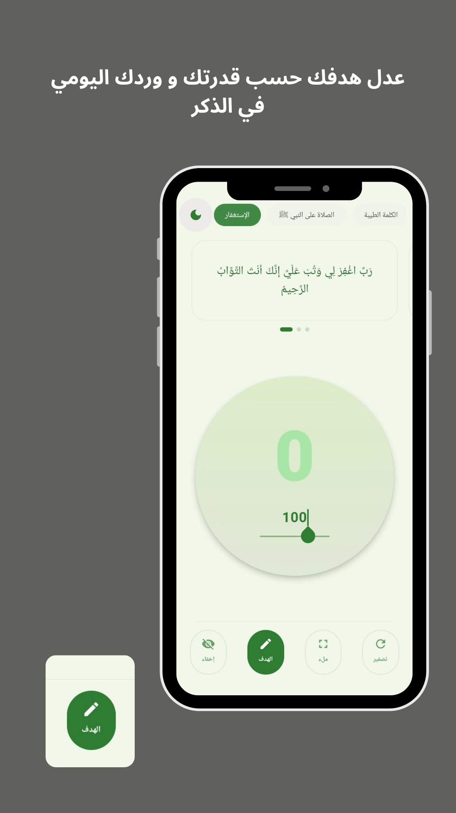
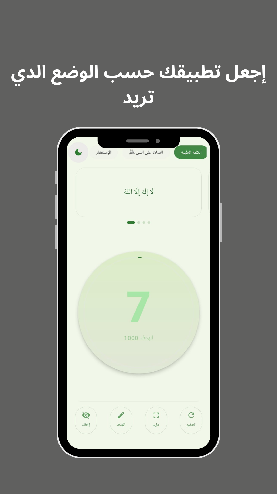
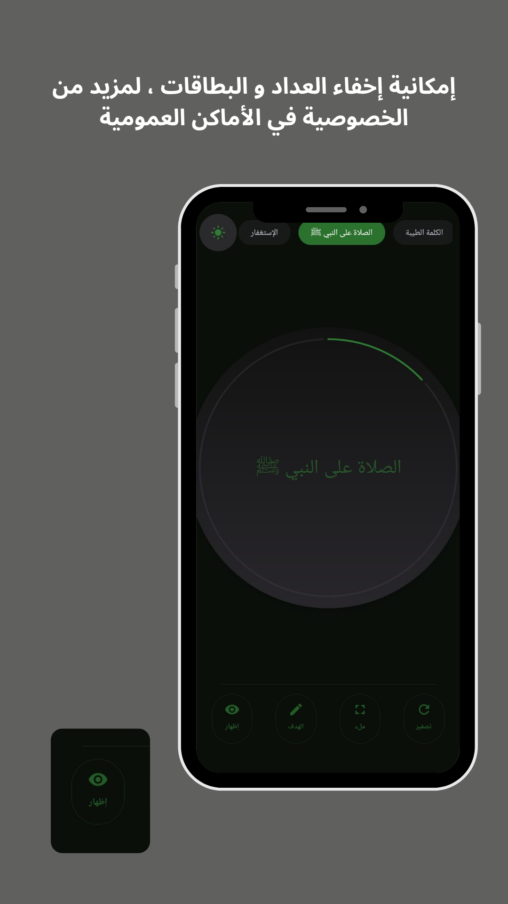
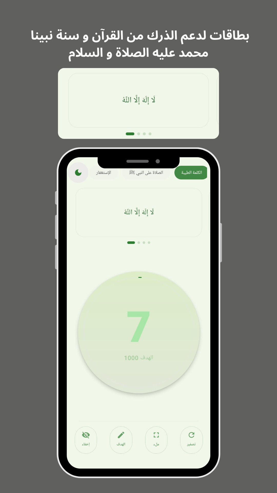

# سبحتي - Sobhaty 📿

تطبيق مسبحة إلكترونية عصري وبسيط تم بناؤه باستخدام **Jetpack Compose**، يهدف إلى مساعدتك في ذكر الله بسهولة ويسر مع واجهة مستخدم مريحة وهادئة.

  

## ✨ المميزات
- **مجموعة متنوعة من الأذكار:** تشمل التسبيح، الاستغفار، والصلاة على النبي ﷺ.
- **تخصيص الأهداف:** إمكانية تعديل الهدف اليومي حسب قدرتك ووردك.
- **الخصوصية:** ميزة إخفاء العداد والبطاقات لمزيد من الخصوصية في الأماكن العامة.
- **الوضع الليلي والنهاري:** دعم كامل للثيم الداكن والفاتح بما يريح العين.
- **وضع ملء الشاشة:** للتركيز الكامل أثناء الذكر.
- **اهتزاز وتفاعل:** دعم ردود الفعل اللمسية (Haptic Feedback) عند التسبيح.

## 📸 لقطات من التطبيق

| الصفحة الرئيسية | تغيير الأذكار | تخصيص الهدف |
|---|---|---|
|  |  |  |

| الوضع الداكن | إخفاء العداد (الخصوصية) | دعم اللغات |
|---|---|---|
|  |  |  |

## 🛠 التقنيات المستخدمة
- **Kotlin** - لغة البرمجة الأساسية.
- **Jetpack Compose** - لبناء واجهة المستخدم الرسومية.
- **ViewModel & LiveData** - لإدارة حالة البيانات.
- **DataStore** - لحفظ إعدادات المستخدم والعداد بشكل دائم.
- **Material 3** - لأحدث معايير التصميم من جوجل.

## 🚀 التحميل والتشغيل
1. قم بعمل `Clone` للمستودع.
2. افتح المشروع باستخدام **Android Studio (Ladybug)** أو أحدث.
3. قم بتشغيل التطبيق على المحاكي أو هاتفك الخاص.

---
**بواسطة [Mohammed Ali Zeggaf]**
**linkedin link : [https://www.linkedin.com/in/mohamed-ali-zeggaf/]**
